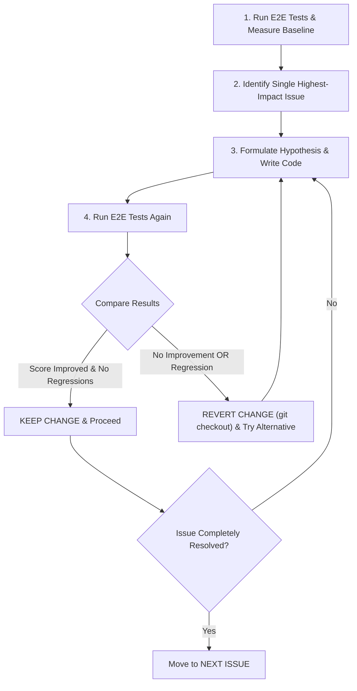

# Iterative Development Protocol & Assessment

## 1. Iterative Development Protocol (Strict One-Issue-at-a-Time Rule)

We will strictly follow the iterative protocol for every single issue:



### Protocol Steps:

1. **Run E2E Tests**: Execute standard resolution verification and record baseline match percentages and page counts for all samples (`InternshipCover`, `MotivationLetter`, `OnlineVideoDepositTutorial`).
2. **Identify ONE Specific Issue**: Isolate a single root cause (e.g. Table center alignment offset bug in `TableRenderer.cs`).
3. **Write Code & Follow Guidelines**: Implement the targeted fix while preserving API contracts and existing test coverage.
4. **Re-run E2E Tests**: Run verification immediately after modifying code.
5. **Compare Metric Deltas**:
   - **Improvement**: If `Score_new > Score_old` with zero regressions, keep the change.
   - **No Improvement / Regression**: If `Score_new <= Score_old` or another sample regresses, **revert changes immediately** (`git checkout`) and attempt an alternative fix hypothesis.
   - **Issue Resolved**: If the issue is completely eliminated, select the next single issue from the queue.

## 2. Verification Plan

- For each step in the queue, run:
  ```bash
  dotnet test
  ```
- Compare scorecards before and after each change. Revert immediately on any score degradation.
